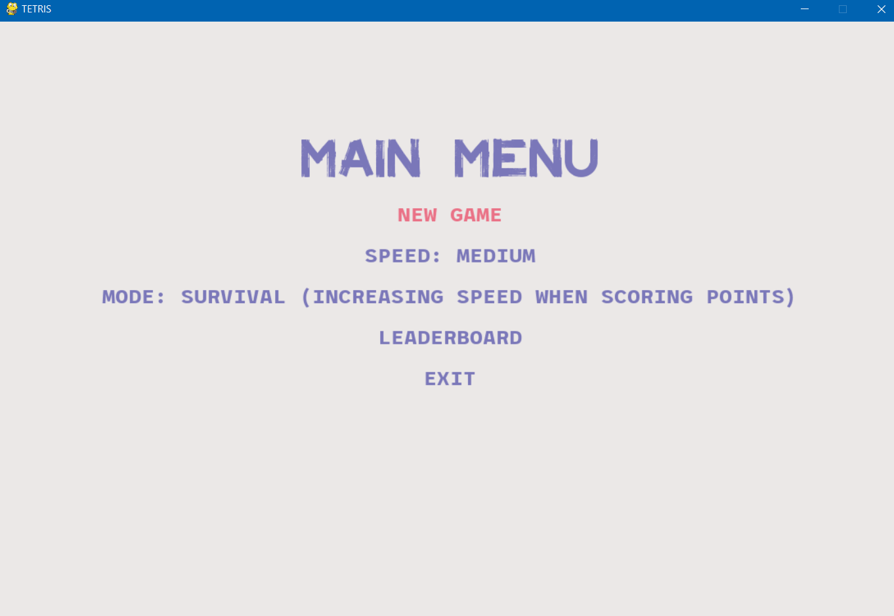

<div align="center">
<h1 align="center">Tetris</h1></div>

## Table of contents
* [General info](#general-info)
* [Technologies](#technologies)
* [Setup & Installation](#setup-&-installation)
* [Running The App](#running-the-app)
* [Features](#features)
* [Demo](#demo)
* [Status](#status)
* [Contact](#contact)

## General info
**Tetris game** created in **PyGame.** 

## Technologies
* Python 3.9.x
* PyGame 2.0.x

## Setup & Installation
Make sure you have the latest version of Python installed.
```bash
git clone <repo-url>
```

```bash
pip install -r requirements.txt
```

## Running The App
```bash
python main.py
```

## Features
* Saving information about last game to csv file
* Score and combo system
* Timer
* Leaderboard
* 3 available game mode
* 3 available game speed

## Demo


## Status 
Project in progress.

## Contact
Created by [@Gamattowicz](https://github.com/Gamattowicz) - feel free to contact me!